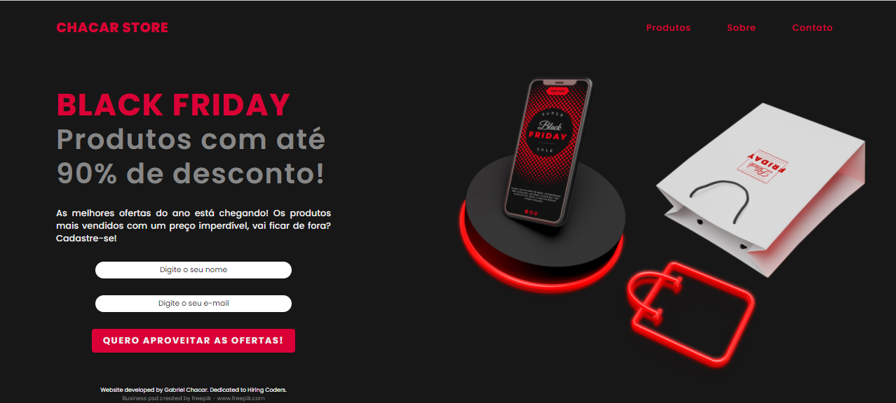

# Hiring Coders #2 - Primeiro Desafio Prático (Landing Page - Black Friday)

### Sobre o Projeto:

Landing Page com base na Black Friday com o objetivo de capturar leads e foi desenvolvida para o primeiro desafio de Hiring Coders #2 da Gama Academy. A página foi baseada em <a href="https://youtu.be/JYWitDwHhxE">esse tutorial.</a>

### Reconhecimento:

Gostaria de deixar registrado aqui, minha gratidão ao Programa Hiring Coders #2, da Gama Academy, por estar me ensinando e me moldando para ser um excelente profissional, obrigado a todos os envolvidos.

### Preview:

### Tecnologias usadas nesse projeto:

- HTML
- CSS
- JavaScript

### Creditos:

<a href="https://www.freepik.com">Business PSD created by Freepik.</a>
